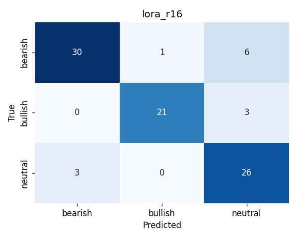
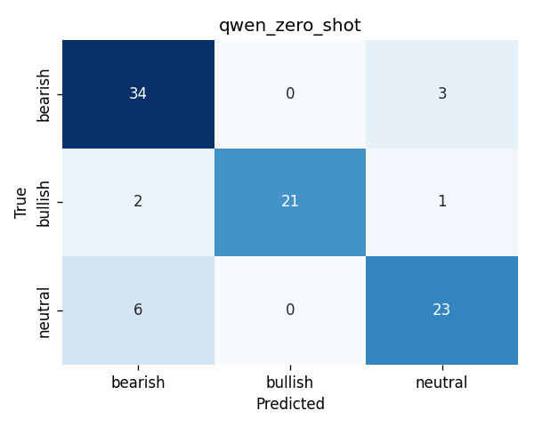

# Financial Sentiment Classifier — LoRA Fine-tuning Case Study

[](https://colab.research.google.com/github/David0hy/llm-financial-sentiment-lora/blob/main/run_in_colab.ipynb)

A focused case study fine-tuning a small open-source LLM (Qwen2.5-1.5B-Instruct)
with **LoRA / PEFT** for financial sentiment classification, benchmarked against
zero-shot prompting baselines.

**Task**: Given a finance-related tweet, classify the sentiment as one of:
- **bearish** — negative outlook on a stock, market, or economic indicator
- **bullish** — positive outlook
- **neutral** — factual, informational, or non-directional

**Data**: [`zeroshot/twitter-financial-news-sentiment`](https://huggingface.co/datasets/zeroshot/twitter-financial-news-sentiment) —
a public, MIT-licensed corpus of ~12k annotated finance tweets. We subsample
600 examples (balanced across the three classes) to keep training fast on
a free Colab T4 GPU.

## Key Results

Evaluated on a held-out test set of 90 finance tweets (15% of 600 samples,
balanced across bearish / bullish / neutral).

| Approach | Accuracy | Macro F1 | Trainable Params | Training Time |
|---|---|---|---|---|
| Zero-shot (Qwen2.5-1.5B) | **86.7%** | **0.872** | 0 | 0 |
| LoRA SFT (r=16, 3 epochs) | 85.6% | 0.861 | 4.4M (0.28% of base) | 76 sec on T4 |

**Per-class F1:**

| | Bearish | Bullish | Neutral |
|---|---|---|---|
| Zero-shot | 0.86 | 0.93 | 0.82 |
| LoRA      | 0.86 | 0.91 | 0.81 |

## Key Finding: When LoRA Doesn't Help

This experiment surfaced a result more useful than a clean win: **LoRA
fine-tuning did not beat zero-shot prompting on this task** (85.6% vs 86.7%).
Three factors explain the result and the lessons generalize:

1. **The base model already saturated the task.** Qwen2.5-1.5B was
   pretrained on substantial financial text. At 86.7% zero-shot, the
   remaining errors are largely on genuinely ambiguous tweets where even
   human annotators would disagree — those errors are not addressable by
   more training on similar-distribution data.

2. **The training set was small (418 examples).** When the base is already
   strong, parameter-efficient fine-tuning needs more signal than this to
   move the needle, especially on a 3-way classification where the decision
   boundary is well-covered by pretraining.

3. **Mild overfit at epoch 3.** Eval loss bottomed at epoch 2 (0.7747)
   and ticked up at epoch 3 (0.7760), suggesting the LoRA adapter was
   beginning to memorize idiosyncrasies of the small training set rather
   than generalize.

### What the confusion matrices reveal

The accuracy numbers tell only part of the story. The per-class error
patterns surface a more interesting finding:

|                     | Zero-shot                          | LoRA                            |
|---------------------|------------------------------------|---------------------------------|
| Bearish → Neutral   | 3 errors                           | **6 errors** (↑)                |
| Neutral → Bearish   | **6 errors**                       | 3 errors (↓)                    |
| Bearish → Bullish   | 0                                  | 1 (↑)                           |

LoRA didn't fail to learn — it learned a **different decision boundary**.
The adapter shifted the model's preference on ambiguous bearish/neutral
tweets: zero-shot leans toward calling them *bearish*, LoRA leans toward
calling them *neutral*. Net accuracy is roughly conserved because the two
error directions roughly cancel on this particular test set.

This is a real behavioral change introduced by the 4.4M trainable parameters
— not noise. Whether it's a useful change depends on the downstream
application: a system that surfaces "potentially bearish" tweets for analyst
review would prefer the zero-shot bias (higher recall on bearish); a system
that flags only confidently negative sentiment for automated trading would
prefer the LoRA bias (fewer false bearish positives).




### Engineering takeaway

Parameter-efficient fine-tuning is not a free win. The decision to fine-tune
should be made by **measuring the zero-shot ceiling first**, not by default.
When zero-shot is already near the task ceiling, the engineering effort is
better spent on: data quality and labeling, prompt design, evaluation
framework, or moving to a smaller base model for cost savings (since LoRA's
key advantage — sample-efficient adaptation — isn't being exercised).

## Project Structure

```
.
├── README.md
├── requirements.txt
├── run_in_colab.ipynb          # One-click runner for the entire pipeline
├── data/
│   └── build_dataset.py        # Pull from HuggingFace and write samples.jsonl
└── src/
    ├── prompting_baseline.py   # Zero-shot baseline with Qwen and GPT-4o-mini
    ├── train_lora.py           # LoRA SFT with HuggingFace PEFT
    ├── infer_lora.py           # Inference using the trained adapter
    └── eval.py                 # Unified evaluation across all approaches
```

## Quick Start

The simplest path is to open the Colab notebook (badge at top), which runs
the entire pipeline end-to-end. Locally:

```bash
pip install -r requirements.txt

# Build dataset (~30 seconds, downloads 1MB from HuggingFace)
python data/build_dataset.py --output data/samples.jsonl --n 600

# Run Qwen zero-shot baseline
python src/prompting_baseline.py --model qwen --data data/samples.jsonl

# Train LoRA
python src/train_lora.py --base Qwen/Qwen2.5-1.5B-Instruct --rank 16 --epochs 3

# Inference + eval
python src/infer_lora.py --adapter checkpoints/lora_r16 --data data/samples.jsonl
python src/eval.py --all
```

## Technical Details

**Base model**: `Qwen/Qwen2.5-1.5B-Instruct` — chosen for fitting on a single
T4 GPU (Colab free tier) with room for LoRA adapters and a reasonable batch
size.

**LoRA configuration**:
- Rank: 16
- Target modules: `q_proj`, `k_proj`, `v_proj`, `o_proj` (attention projections)
- Alpha: 32, Dropout: 0.05
- Trained with `transformers.Trainer` + `peft.LoraConfig`

**Training setup**: fp16 mixed precision (T4 doesn't support bf16),
cosine LR schedule with 3% warmup, AdamW optimizer, 3 epochs.

**Evaluation**: held-out 15% test split, reporting accuracy and per-class F1.

## What this is not

A focused case study, not a production sentiment system. Real-world
financial sentiment classification would benefit from a larger dataset,
multi-task setup with finer-grained sentiment, robustness to financial
jargon and ticker symbols, and proper calibration for downstream use in
trading or alerting systems. Those are out of scope here — the goal is to
isolate the LoRA contribution in a controlled setting.

## License

MIT
